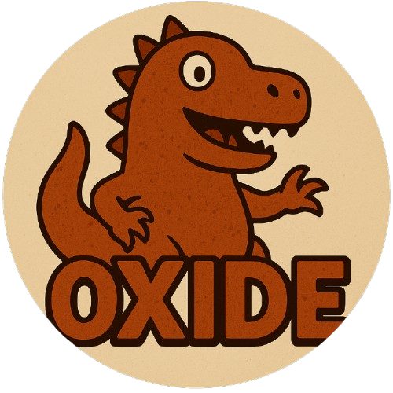

<div align="center">
  
</div>

# <div align="center"> Oxide </div>

<div align="center">

  [![License][license-badge]][license-link]
  [![lichess-badge]][lichess-link]
  
</div>

## Overview

`Oxide` started as a simple terminal-based chess project in my personal repository [Projects](https://github.com/Miguevrgo/Projects), but it evolved into something much bigger. A professor proposed it as a challenge, and I took it seriously, transforming it from a basic command-line game into a fully-fledged UCI-compliant chess engine written in Rust. The goal? To learn, to enjoy coding something complex without a GUI, and to build a clean, efficient, and readable piece of software.

This engine is designed to be both a learning experience and a playground for exploring chess programming. It leverages bitboards for board representation, implements move generation with obstruction difference techniques, and aims to balance simplicity with performance. Whether you're a chess enthusiast or a Rust programmer, I hope you find something interesting here!

## Features

- **Complete Chess Implementation:** Fully functional chess rules, including castling, en passant, promotions, and check/checkmate detection.
- **Bitboards:** Efficient board representation using bitboards for fast move generation and evaluation.
- **Obstruction Difference:** Move generation optimized with obstruction difference for sliding pieces.
- **UCI Compliance:** Generally compatible with UCI (Universal Chess Interface), making it playable in tools like CuteChess, Lichess (via bots), or any UCI-supporting GUI. Missing threads, table size options
- **Alpha-Beta Pruning:** Search algorithm with alpha-beta pruning for efficiency, enhanced with several techniques, using a single thread for more comprehensive read.
- **Simplicity & Readability:** Codebase designed to be as straightforward as possible while maintaining decent performance.
- **Inspiration:** Built with insights from the [Chess Programming Wiki](https://www.chessprogramming.org/), and engines like [Carp](https://github.com/dede1751/carp) and [Akimbo](https://github.com/jnlt3/akimbo), to whom I the implementation for the NNUE ⚠️ The Oxide nets provided with the release are trained using [linrock](https://huggingface.co/datasets/linrock/test80-2024/tree/main) datasets.

## Objectives & Planned Improvements

`Oxide` is a work in progress with clear goals and some fixes on the horizon:

- **Expand UCI Features:** Include additional info (seldepth) as well as tune iterative deepening for time based depth.
- **Enhance Search:** Several search improvements have been made, some of them require another deep check, also, the following enhancements are planned to be tested:
  - Razoring
  - SEE
  - Killer Heuristic
  - Extensions
- **NNUE** Use a new approach.
## Getting Started

### Prerequisites
- Rust (stable, install via [rustup](https://rustup.rs/)).
- A UCI-compatible GUI (e.g., [CuteChess](https://cutechess.com/)).

### Build & Run
   ```bash
   git clone https://github.com/Miguevrgo/Oxide.git
   cd Oxide
   RUSTFLAGS="-C target-cpu=native" cargo build --release
   ./target/release/oxide
```
If you want to make a perft test just run:
```
  cargo test --release -- --nocapture
```
Or you can directly use the perft UCI command.


[license-badge]:https://img.shields.io/github/license/miguevrgo/Oxide?style=for-the-badge&label=license&color=success
[license-link]:https://github.com/Miguevrgo/Oxide/blob/main/LICENSE
[lichess-link]:https://lichess.org/@/OxideEngine
[lichess-badge]:https://img.shields.io/badge/Play%20Oxide_Engine%20-v1-yellow?logo=lichess&style=for-the-badge
